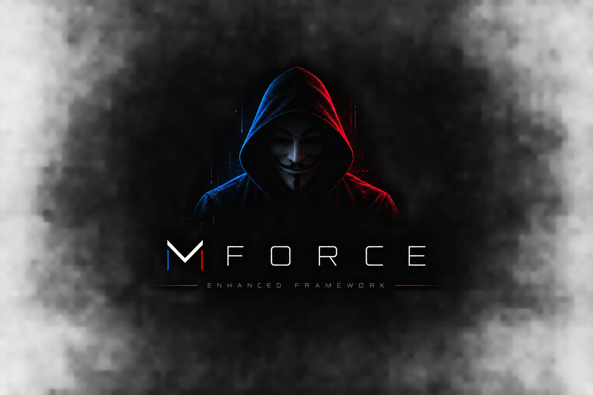

# MForce Enhanced

<p align="center">
  
</p>

<p align="center">
  <strong>A modular and extensible framework for Termux.</strong>
</p>

<p align="center">
  <a href="https://github.com/USERNAME/MForce-Enhanced/stargazers">
    
  </a>
  <a href="https://github.com/USERNAME/MForce-Enhanced/network/members">
    
  </a>
  <a href="https://github.com/GotUrBack04/MForce-Enhanced/graphs/contributors">
    
  </a>
</p>

<p align="center">
  
  
  
  
</p>

---

## About

**MForce Enhanced** is the next generation of the MForce framework, rebuilt from the ground up for **Termux**.

The project focuses on a modular architecture, a dedicated terminal interface, separated functionality layers and reusable internal libraries.

MForce Enhanced is designed to make tools easy to organize, extend and maintain while keeping the framework lightweight and fully terminal-based.

> **Current version:** `v0.01.0`

---

## Features

- Modular framework architecture
- Interactive terminal user interface
- Keyboard-based navigation
- Category and function selection
- Dedicated UI pages
- Function entry-point system
- Separated library structure
- Central resource libraries
- JSON-based configuration and metadata
- Authentication layer
- Custom terminal color system
- Extensible tool architecture
- Termux-focused design
- Lightweight Shell implementation

---

## Architecture

MForce Enhanced uses several layers instead of placing every tool inside a single modules directory.

```text
MForce-Enhanced/
│
├── xrm742.sh
│
├── classes1.lib
├── classes2.lib
├── classes3.lib
├── classes4.lib
├── classes5.lib
│
├── src/
│   │
│   ├── ui/
│   │   ├── epos.sh
│   │   ├── cs.sh
│   │   ├── fs.sh
│   │   ├── cp.sh
│   │   ├── fp.sh
│   │   └── ap.sh
│   │
│   ├── colors/
│   │   ├── bse.sh
│   │   ├── uic.sh
│   │   ├── sts.sh
│   │   ├── mnu.sh
│   │   └── clrs.json
│   │
│   ├── functions/
│   │   ├── lar386.sh
│   │   ├── qtx742.sh
│   │   └── ...
│   │
│   ├── lib/
│   │   ├── frc386/
│   │   │   ├── frc386.sh
│   │   │   ├── frc386.conf
│   │   │   ├── frc386.help
│   │   │   ├── frc386.json
│   │   │   └── data.json
│   │   └── ...
│   │
│   ├── data/
│   │   ├── cats.json
│   │   ├── funcs.json
│   │   └── cfg.json
│   │
│   └── auth/
│       ├── lgn.sh
│       ├── sns.sh
│       └── ath.json
│
├── assets/
│   ├── logo.png
│   └── banners/
│
└── cfg/
    └── zrk391.json
Interface
The framework does not rely on a single large menu script.
Each major interface screen is separated into its own component.
xrm742.sh
    │
    ▼
 epos.sh
    │
    ▼
  lgn.sh
    │
    ▼
  cs.sh
    │
    ▼
  fs.sh
    │
    ▼
function entry point
    │
    ▼
library
This allows individual interface components to be developed and maintained independently.
Function System
Functions are separated from their underlying libraries.
For example:
src/functions/
└── lar386.sh
can point toward:
src/lib/frc386/
├── frc386.sh
├── frc386.conf
├── frc386.help
├── frc386.json
└── data.json
This separation allows a function entry point to remain small while the actual implementation and resources stay inside its dedicated library.
Central Libraries
MForce Enhanced also provides five central library/resource files:
classes1.lib
classes2.lib
classes3.lib
classes4.lib
classes5.lib
These files contain reusable resources that can be accessed by framework components when required.
They act as a shared resource layer between the different parts of the framework.
Configuration
Configuration and metadata are handled separately from the Shell logic.
JSON files are used throughout the framework for things such as:
Framework configuration
Categories
Functions
Library metadata
Authentication configuration
Color themes
Tool-specific data
This keeps configuration separate from executable logic.
Installation
Requirements
Android
Termux
Bash
Git
Clone the repository
git clone https://github.com/USERNAME/MForce-Enhanced.git
cd MForce-Enhanced
Start MForce Enhanced
chmod +x xrm742.sh
./xrm742.sh
The root launcher forwards execution to the framework entry point.
Development
MForce Enhanced is currently in an early development stage.
Current version
v0.01.0
The architecture is established first. Individual framework components and tools will be added progressively.
Roadmap
[x] Initial project architecture
[x] Modular directory structure
[x] Dedicated UI layer
[x] Function entry-point concept
[x] Library structure
[x] Central resource libraries
[x] JSON configuration concept
[ ] Interactive navigation system
[ ] Category browser
[ ] Function browser
[ ] Authentication system
[ ] Theme system
[ ] Function loader
[ ] Library/resource loader
[ ] Update system
[ ] Documentation
[ ] First stable release
Contributing
Contributions are welcome.
Before submitting a pull request, please make sure that your changes:
Follow the existing project structure
Keep UI, functions and libraries separated
Do not unnecessarily duplicate existing functionality
Include relevant configuration or metadata
Work correctly in Termux
Do not introduce unnecessary dependencies
License
MForce Enhanced is released under the MIT License.
See the LICENSE file for the full license text.
Disclaimer
MForce Enhanced is provided for educational, development and authorized security-related use.
Users are responsible for ensuring that their use of the framework and its tools complies with applicable laws and the rules of the systems they interact with.
�
MForce Enhanced 
Built for Termux · v0.01.0 
::: ```
